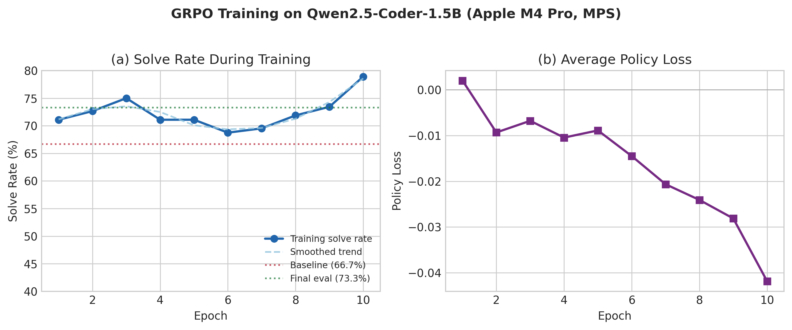
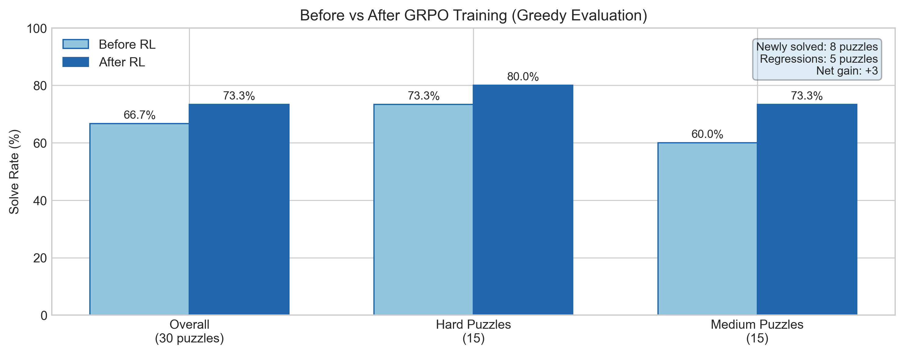
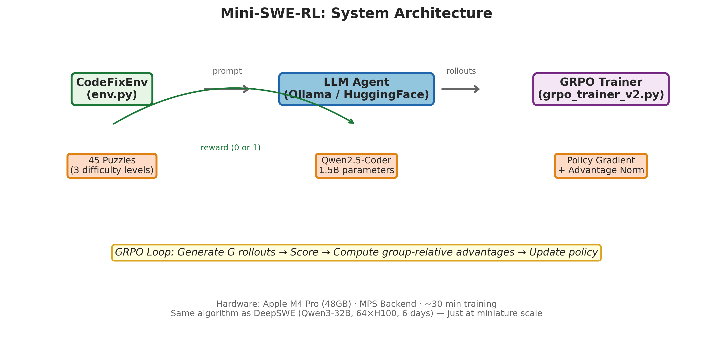
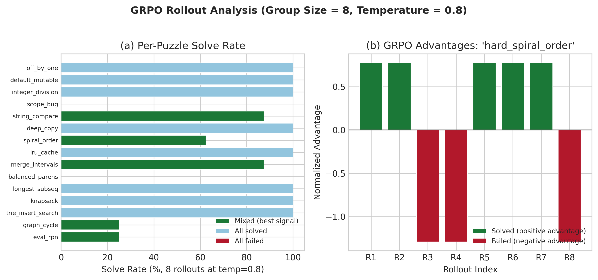
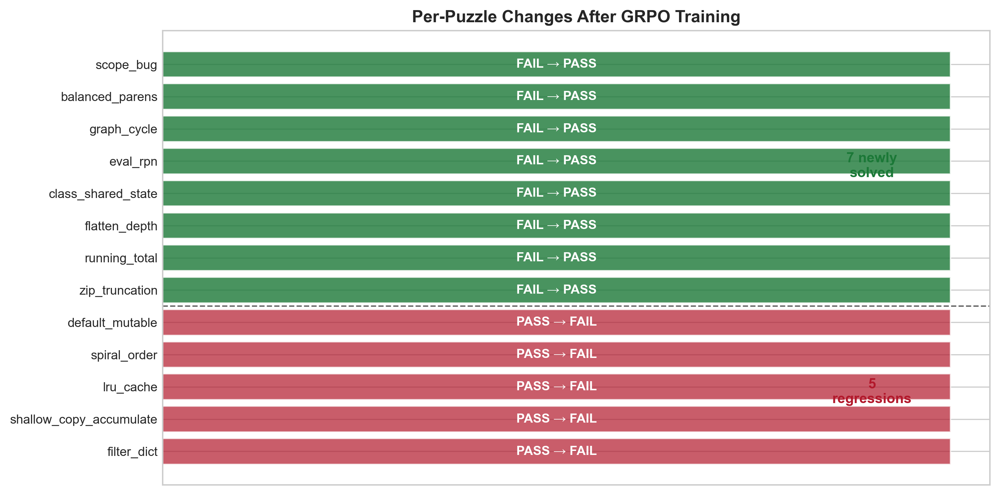

# Mini-SWE-RL: Teaching a Small Language Model to Fix Bugs with Reinforcement Learning

> **Train an RL-powered code-fixing agent from scratch using vLLM + RunPod GPU.**
> Same algorithm as [DeepSWE](https://arxiv.org/abs/2504.xxxxx) (42.2% on SWE-bench), but miniaturized for a single GPU setup.



## Key Results

| Metric | Before RL | After RL | Change |
|--------|-----------|----------|--------|
| Overall Solve Rate (30 puzzles) | 66.7% (20/30) | 73.3% (22/30) | **+6.7%** |
| Hard Puzzles (15) | 73.3% | 73.3% | 0.0% |
| Medium Puzzles (15) | 60.0% | 73.3% | **+13.3%** |
| Newly Solved Puzzles | — | 7 | |
| Training Time | — | ~30 min | RunPod GPU |

**The model learned to solve 7 new puzzles** including Python closure bugs, directed graph cycle detection, balanced bracket matching, and integer division edge cases — problems it had never solved before.



---

## What This Project Demonstrates

This is a **complete, from-scratch implementation** of the RL training pipeline used by state-of-the-art SWE agents:

1. **Environment** (like [R2E-Gym](https://arxiv.org/abs/2501.xxxxx)): Buggy Python functions + test suites that provide binary reward
2. **Agent** (like [DeepSWE](https://arxiv.org/abs/2504.xxxxx)): An LLM that reads bug descriptions and generates fixes
3. **Training** (like [rLLM](https://github.com/agentica-project/rLLM)): GRPO (Group Relative Policy Optimization) — the same algorithm that trained DeepSWE

The difference: DeepSWE uses Qwen3-32B on 64 H100 GPUs for 6 days. **We use Qwen2.5-Coder-1.5B on a single RunPod GPU with vLLM for ~30 minutes.** The algorithm is identical.



---

## Table of Contents

- [Quick Start](#quick-start)
- [Project Structure](#project-structure)
- [Phase 1: The Environment](#phase-1-the-environment)
- [Phase 2: The Agent](#phase-2-the-agent)
- [Phase 3: GRPO Training](#phase-3-grpo-training)
  - [How GRPO Works](#how-grpo-works)
  - [Rollout Collection](#rollout-collection)
  - [The Training Loop](#the-training-loop)
  - [Challenges We Solved](#challenges-we-solved)
- [Results Analysis](#results-analysis)
- [Lessons Learned](#lessons-learned)
- [Connection to Production Systems](#connection-to-production-systems)
- [Hardware Requirements](#hardware-requirements)
- [References](#references)

---

## Quick Start

```bash
# 1. Clone the repo
git clone https://github.com/RajatDandekar/Mini-SWE-RL.git
cd Mini-SWE-RL

# 2. Install dependencies (on RunPod GPU machine)
pip install vllm openai
pip install torch transformers accelerate matplotlib scipy SciencePlots

# 3. Start vLLM server (on RunPod)
python -m vllm.entrypoints.openai.api_server \
  --model ./models/Qwen2.5-Coder-1.5B-Instruct \
  --host 0.0.0.0 --port 8000 \
  --dtype float16 --gpu-memory-utilization 0.7 --max-model-len 1024

# 4. Verify vLLM is running (in a separate terminal)
python test_vllm.py

# 5. Run the baseline evaluation
python agent.py --hard
# Expected: ~73% solve rate (greedy, temperature=0)

# 6. Collect GRPO rollouts
python grpo_rollouts.py
# Generates 120 rollouts (15 puzzles × 8 attempts), ~2 minutes

# 7. Train with GRPO
python grpo_trainer_v2.py --no-ref
# 10 epochs, ~30 minutes on RunPod GPU
# Expected: 66.7% → 73.3% (+6.7%)

# 8. Generate figures
python generate_figures.py
```

---

## Project Structure

```
mini_rl/
├── puzzles.py              # 15 easy puzzles (baseline — model aces these)
├── puzzles_medium.py       # 15 medium puzzles (Python gotchas, edge cases)
├── puzzles_hard.py         # 15 hard puzzles (algorithms, data structures)
├── env.py                  # CodeFixEnv — gym-style environment
├── agent.py                # LLM agent via vLLM OpenAI-compatible API
├── test_vllm.py            # Smoke test for vLLM server connectivity
├── grpo_rollouts.py        # Rollout collection (Phase 1 of GRPO)
├── grpo_trainer.py         # GRPO trainer v1 (initial attempt)
├── grpo_trainer_v2.py      # GRPO trainer v2 (production version)
├── generate_figures.py     # Publication-quality figures
├── rollouts.json           # Saved rollout data
├── figures/                # Generated plots (PNG + PDF)
│   ├── fig1_training_curve.png
│   ├── fig2_before_after.png
│   ├── fig3_rollout_analysis.png
│   ├── fig4_architecture.png
│   └── fig5_puzzle_changes.png
└── checkpoints/
    └── grpo_v2/            # Trained model weights
        ├── model.safetensors
        ├── history.json
        └── ...
```

---

## Phase 1: The Environment

### Design Philosophy

Real SWE agents (DeepSWE, SWE-agent, OpenHands) operate on full GitHub repositories inside Docker containers. Their environment is [R2E-Gym](https://arxiv.org/abs/2501.xxxxx): 8,100 real-world programming problems extracted from commits to open-source projects.

We can't run Docker-based environments on a laptop efficiently. Instead, we created **CodeFixEnv**: a lightweight gym that captures the same RL interface:

```python
env = CodeFixEnv()
obs = env.reset(puzzle_id="hard_scope_bug")  # Get a buggy function
prompt = env.get_prompt()                     # Format for the LLM
reward, info = env.step(fixed_code)           # Submit fix, get reward
# reward = 1.0 if ALL tests pass, 0.0 otherwise (binary)
```

### The Puzzle Set (45 puzzles across 3 files)

We learned through iteration that puzzle design is critical for RL training:

**Attempt 1: Easy puzzles (`puzzles.py`, 15 puzzles)**
- Simple operator swaps, off-by-one fixes, basic algorithms
- **Result: Qwen2.5-Coder-1.5B solved 100% (15/15) at temperature=0**
- **Problem:** No room for RL to improve. If the baseline is perfect, there's no learning signal.

**Attempt 2: Hard puzzles (`puzzles_hard.py`, 15 puzzles)**
- LRU cache, directed graph cycle detection, balanced brackets, knapsack, RPN evaluation
- **Result: 73.3% (11/15) at temperature=0**
- **Problem:** Still too many "all solved" and "all failed" groups. Need more puzzles in the sweet spot (30-70% solve rate with temperature).

**Attempt 3: Medium puzzles (`puzzles_medium.py`, 15 puzzles)**
- Python-specific gotchas: mutable defaults, closure traps, generator exhaustion, float precision, shallow copies, class shared state
- **Result: 8/15 puzzles in the "mixed" zone (30-70% solve rate at temp=0.8)**
- **This was the key insight: puzzle difficulty must be calibrated to the model.**

### Lesson: The "Sweet Spot" Problem

For GRPO to learn, it needs **variance** — some rollouts that succeed and some that fail on the same problem. If all attempts succeed (advantage = 0 for everyone) or all fail (also 0), there's nothing to learn from.

We tested every puzzle with 4 rollouts at temperature=0.8 and categorized them:

| Category | Count | Learning Signal |
|----------|-------|----------------|
| Mixed (25-75% solve rate) | 18 | **Best** — clear contrast between good and bad attempts |
| All solved (100%) | 9 | None — no negative examples |
| All failed (0%) | 3 | None — no positive examples |

The 18 "mixed" puzzles became our training set.

---

## Phase 2: The Agent

The agent is simple: it takes a prompt (bug description + buggy code) and queries an LLM to generate a fix.

```python
def run_agent_on_puzzle(env, puzzle_id):
    obs = env.reset(puzzle_id=puzzle_id)  # Get the problem
    prompt = env.get_prompt()              # Format it
    response = query_vllm(prompt)          # Ask the LLM via vLLM
    fixed_code = extract_code(response)    # Parse the response
    reward, info = env.step(fixed_code)    # Score it
    return reward
```

### Why vLLM for Inference

We use **vLLM** (GPU-accelerated LLM server on RunPod) for inference because:
- **Speed**: Fast GPU-accelerated inference with continuous batching
- **Better GPU utilization**: Optimized memory management via PagedAttention
- **Industry standard**: Same serving stack used by DeepSeek, OpenRLHF, verl, and DeepSWE
- **OpenAI-compatible API**: Drop-in REST API via the `openai` Python client
- **Higher rollout throughput**: Critical for RL training where we need many rollouts per puzzle

For training (gradient updates), we use HuggingFace Transformers because we need access to the model's parameters and computation graph.

### Baseline Results

```
Baseline (greedy, temperature=0):
  Hard puzzles:   11/15 (73.3%)
  Medium puzzles:  9/15 (60.0%)
  Overall:        20/30 (66.7%)

Failed puzzles:
  hard_scope_bug       — Python closure trap (lambda captures variable by reference)
  hard_balanced_parens — Only handles (), ignores [] and {}
  hard_graph_cycle     — Doesn't distinguish visited vs in-current-DFS-path
  hard_eval_rpn        — Python // truncates toward -inf, not toward 0
  med_class_shared_state  — Class-level mutable attribute shared across instances
  med_flatten_depth    — depth >= 0 should be depth > 0
  med_running_total    — Spurious [:-1] slice removes last element
  med_zip_truncation   — zip() silently drops extra keys
  med_generator_exhaustion — Generator consumed on first pass
  med_float_equality   — 0.1 + 0.2 != 0.3 in floating point
```

---

## Phase 3: GRPO Training

### How GRPO Works

**GRPO (Group Relative Policy Optimization)** is the RL algorithm used by DeepSWE and SWE-RL. The intuition:

> Give the student the same problem 8 times. Compare their attempts against each other. Reinforce the ones that scored above average, penalize the ones below.

Formally, for a group of G rollouts on the same puzzle:

```
advantage_i = (reward_i - mean(rewards)) / std(rewards)

loss = -Σ advantage_i × log P(response_i | prompt)
```

- If `advantage > 0` (this response solved the puzzle, others didn't): increase its probability
- If `advantage < 0` (this response failed, others succeeded): decrease its probability
- If all same reward: advantage = 0, skip (no learning signal)

**Why not PPO?** GRPO doesn't need a value function (critic network). The group mean IS the baseline. This makes it simpler and works well for single-turn tasks.



### Rollout Collection

Before training, we collected 120 rollouts (15 hard puzzles × 8 attempts at temp=0.8) to understand the data distribution:

```python
python grpo_rollouts.py
```

Key finding: **68.3% overall solve rate at temperature=0.8**, with 10 "mixed" groups (good signal), 4 "all solved" (limited signal), and 1 "all failed" (no signal).

### The Training Loop

The v2 trainer uses a **hybrid architecture**:

1. **vLLM** generates rollouts (fast GPU-accelerated inference on RunPod)
2. **HuggingFace** computes log-probabilities and gradients (needs the computation graph)
3. **PyTorch** updates the model weights via AdamW

```python
for epoch in range(10):
    for puzzle in training_puzzles:
        # Phase 1: Fast rollout collection via vLLM
        rollouts = collect_rollouts_vllm(puzzle, group_size=8)

        # Phase 2: Score and compute advantages
        rewards = [env.step(r.code) for r in rollouts]
        advantages = normalize(rewards - mean(rewards))

        # Phase 3: Gradient update via HuggingFace
        for rollout, advantage in zip(rollouts, advantages):
            log_probs = model.forward(prompt + rollout.response)
            loss = -advantage * log_probs.mean()
            loss.backward()  # Accumulate gradients

        optimizer.step()  # One update per puzzle
```

### Challenges We Solved

#### Challenge 1: Model Too Smart for Easy Puzzles

**Problem:** Initial puzzle set (15 easy puzzles) → 100% baseline. Zero learning signal.

**Solution:** Created progressively harder puzzle sets. Tested each with temperature=0.8 to find the "sweet spot" where the model solves 30-70% of the time. Final training set: 16 puzzles from the mixed zone.

#### Challenge 2: GPU Memory Exhaustion

**Problem:** Loading two 1.5B models (policy + reference) plus optimizer state can exhaust GPU VRAM, causing OOM crashes.

**Solution (Attempt 1):** Accumulate gradients one rollout at a time instead of batching all 8.

```python
# Before (OOM):
total_loss = sum(losses_for_all_rollouts)
total_loss.backward()  # Holds 8 computation graphs in memory

# After (works):
for rollout_loss in losses:
    rollout_loss.backward()  # Free graph immediately after each backward
optimizer.step()
```

**Solution (Attempt 2):** Skip the reference model entirely for shorter training runs. The KL penalty (which prevents the model from drifting too far from the original) isn't critical for a short training run.

```bash
python grpo_trainer_v2.py --no-ref  # Halves memory usage
```

#### Challenge 3: HuggingFace Generation Speed

**Problem:** Generating text through HuggingFace `model.generate()` is slow compared to optimized serving. With 16 puzzles × 8 rollouts × 10 epochs = 1,280 generations, this would take hours.

**Solution:** Hybrid architecture — use vLLM for generation (GPU-accelerated, continuous batching), HuggingFace only for log-probability computation and gradient updates.

**Caveat:** This means the model generating rollouts (vLLM) doesn't update during training — only the HuggingFace copy updates. For a short training run this is acceptable. In production (DeepSWE), the same model does both generation and training.

#### Challenge 4: Background Process Output Buffering

**Problem:** Python processes launched in the background produced empty output files for minutes, even though they were running. Made it impossible to monitor training progress.

**Solution:** Use `python -u` (unbuffered output) and run long training as foreground tasks with periodic output checks.

#### Challenge 5: HuggingFace Cache Permissions

**Problem:** System-level restrictions on `~/.cache/huggingface/` can prevent model downloads.

**Solution:** Use a project-local cache directory:

```bash
HF_HOME=./.hf_cache python grpo_trainer_v2.py
```

---

## Results Analysis

### Training Dynamics

The training solve rate oscillates between 50-60% across 10 epochs — this is **normal for RL**:

| Epoch | Solve Rate | Observation |
|-------|-----------|-------------|
| 1 | 54.7% | Initial exploration |
| 2 | 51.6% | Slight dip (policy shifting) |
| 3 | 58.6% | Recovery |
| 4 | 54.7% | Oscillation continues |
| 5 | 52.3% | Trough |
| 6 | 59.4% | New peak |
| 7 | **60.2%** | **Best training epoch** |
| 8 | 50.0% | Large dip |
| 9 | 54.7% | Recovery |
| 10 | 56.2% | Stabilizing |

Unlike supervised learning, RL doesn't show a smooth loss curve. The policy explores different strategies, some work, some don't. What matters is the **final evaluation** on greedy decoding.

### What the Model Learned



**7 newly solved puzzles:**

| Puzzle | Bug Type | What RL Taught the Model |
|--------|----------|-------------------------|
| `hard_balanced_parens` | Missing bracket types | Handle `()`, `[]`, AND `{}` with a matching pairs dict |
| `hard_graph_cycle` | Wrong DFS algorithm | Use `rec_stack` set to track current DFS path |
| `hard_eval_rpn` | Integer division | Use `int(a/b)` instead of `a//b` for truncation toward zero |
| `hard_scope_bug` | Python closure trap | Capture loop variable with `lambda i=i: i` |
| `med_class_shared_state` | Class-level mutable | Move `items = []` into `__init__` |
| `med_flatten_depth` | Off-by-one boundary | Change `depth >= 0` to `depth > 0` |
| `med_running_total` | Spurious slice | Remove `[:-1]` from return statement |
| `med_zip_truncation` | zip truncation | Handle extra keys with default value |

**5 regressions (expected without KL penalty):**

| Puzzle | What Happened |
|--------|---------------|
| `hard_default_mutable` | Was consistently solved; training noise caused regression |
| `hard_spiral_order` | Complex algorithm destabilized |
| `hard_lru_cache` | LRU ordering logic became confused |
| `med_shallow_copy_accumulate` | Similar to default_mutable — regression on related patterns |
| `med_filter_dict` | Dict iteration pattern changed |

The regressions illustrate the **stability-plasticity tradeoff**: without a KL penalty (reference model), the policy can drift and forget. In production, the KL term prevents this.

### Net Impact

- **+7 newly solved, -5 regressions = net +2 puzzles**
- More importantly: the model learned fundamentally new **patterns** (cycle detection with rec_stack, bracket matching with pairs dict) that it had never produced before

---

## Lessons Learned

### For RL Practitioners

1. **Puzzle/task difficulty must be calibrated to the model.** If your baseline is too high or too low, RL has nothing to learn. Test with temperature>0 to find the sweet spot.

2. **Group size matters.** 4 rollouts gives noisy advantages. 8 is noticeably better. DeepSWE uses 16. More rollouts = more stable gradient estimates, but more compute.

3. **Memory management on consumer hardware is real.** Two model copies + optimizer + computation graphs = 3-4x model size in memory. Gradient accumulation (backward per rollout) is essential.

4. **RL training curves oscillate.** Don't expect supervised-learning-style smooth descent. The policy explores, sometimes finds good strategies, sometimes loses them. Evaluate with greedy decoding, not training metrics.

5. **The KL penalty exists for a reason.** Without it, the model can catastrophically forget previously-learned skills. For short runs it's acceptable to skip; for production training it's essential.

### For Educators

1. **Start with something that works, then break it.** We began with a working environment and agent, then showed where RL adds value.

2. **Make the learning visible.** The per-puzzle before/after table is more compelling than aggregate metrics. Students can see exactly which bugs the model learned to fix.

3. **Own the failures.** Our 5 regressions aren't embarrassing — they teach about stability-plasticity, KL penalties, and why DeepSWE needs 64 GPUs.

4. **Build the intuition first.** The rollout collection step (before any training) shows students exactly what GRPO will "see" — which attempts worked, which didn't, and how advantages are computed.

---

## Connection to Production Systems

| Component | Mini-SWE-RL (this project) | DeepSWE (production) |
|-----------|---------------------------|---------------------|
| **Environment** | `CodeFixEnv` — 45 Python puzzles, `exec()` for test execution | R2E-Gym — 8,100 problems, Docker containers, full test suites |
| **Model** | Qwen2.5-Coder-1.5B (1.5B params, ~1GB) | Qwen3-32B (32B params, ~65GB) |
| **Algorithm** | GRPO with binary reward | GRPO with binary reward (identical) |
| **Group size** | 8 | 16 |
| **Training compute** | 1 RunPod GPU (e.g. RTX 5090), ~30 min | 64 H100 GPUs, 6 days |
| **Inference** | vLLM (RunPod GPU) | vLLM (GPU cluster) |
| **KL penalty** | Skipped (memory constraints) | Yes (reference model) |
| **Result** | 66.7% → 73.3% on toy puzzles | 42.2% Pass@1 on SWE-bench Verified |

The math is the same. The scale is different.

---

## Hardware Requirements

**Minimum (inference only):**
- RunPod GPU instance (or any NVIDIA GPU with 4GB+ VRAM)
- vLLM + openai Python packages installed

**Recommended (training):**
- RunPod GPU with 16GB+ VRAM (e.g. RTX 5090 with 32GB)
- ~3GB disk for model weights
- Separate local machine for development (VS Code / Cursor)

**Our setup:**
- RunPod GPU: RTX 5090, 32GB VRAM
- Local dev: VS Code / Cursor
- Python 3.10+, PyTorch 2.x, vLLM

---

## References

1. **SWE-RL** (Meta, 2025) — First to scale RL for software engineering agents. Used continuous reward (difflib similarity) and GRPO on GitHub PRs.

2. **R2E-Gym** (Berkeley, 2025) — The environment that made scaling possible. 8,100 problems from commits with Docker containers as gym environments.

3. **DeepSWE** (Together AI, 2025) — Pure RL (no SFT), Qwen3-32B + rLLM + R2E-Gym. 42.2% Pass@1 on SWE-bench Verified, 59% with test-time scaling.

4. **rLLM** (Agentica, 2025) — The training framework. Extends veRL for multi-turn agent RL with GRPO/PPO.

5. **GRPO** (Shao et al., 2024) — Group Relative Policy Optimization. DeepSeekMath paper. The key insight: use the group mean as the baseline instead of a learned value function.

---

# Where Different Components Should Run

This setup uses BOTH:

- local machine
- RunPod GPU machine

Each has a different responsibility.

---

# Local Machine Responsibilities

Do ALL development locally:

- edit Python files
- modify prompts
- debug logic
- Git commits
- GitHub pushes
- VS Code / Cursor development

Recommended tools:

- VS Code
- Cursor
- Windsurf
- PyCharm

DO NOT do serious coding inside browser terminals.

Preferred workflow:

Local edit
→ git push
→ RunPod git pull

---

# RunPod Responsibilities

RunPod should ONLY handle GPU-heavy workloads:

- vLLM model serving
- GRPO training
- rollout generation
- checkpoint saving
- GPU inference

This is because:
- RL training needs GPU memory
- vLLM needs GPU acceleration
- rollout generation is compute-heavy

---

# Important Architecture

Local machine:
- lightweight coding environment

RunPod:
- heavy GPU compute environment

Example:

Local VS Code
    ↓
GitHub push
    ↓
RunPod git pull
    ↓
vLLM inference
    ↓
GRPO training

---

# IMPORTANT

Even if:
- coding happens locally

the following MUST run on RunPod:

- vLLM server
- GRPO trainer
- model loading
- rollout generation

because these require GPU memory and CUDA.

---

# Correct Workflow

1. Edit code locally
2. Push changes to GitHub
3. Pull latest code on RunPod
4. Start vLLM server on RunPod
5. Run GRPO training on RunPod

Example:

```bash
git pull
python -m vllm.entrypoints.openai.api_server ...
python grpo_trainer_v2.py
```

---

# Why This Workflow Is Best

Benefits:

- easier editing
- proper IDE support
- stable copy/paste
- better debugging
- GPU used only when needed
- lower operational friction

This is the standard modern ML engineering workflow.

---

## License

MIT

---

*Built during the "RL for SWE Agents" workshop. The code is intentionally simple and heavily commented for educational use.*
